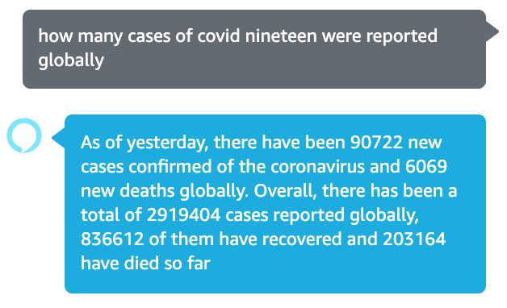

  <h1>Alexa Covid19 Tracker</h1>
  
 
    
  

You can ask Alexa about Covid19 cases such as how many cases have been reported in a state or a country. You can also ask about the top states and countries with most cases and more!

## Technologies
- **Node.js**: Backend to create the skills
- **AWS Lambda**: Backend to host the skills
- **AWS S3**: Storage to store user's previously requested state

## Data Provider
- **[NovelAPI](https://github.com/NovelCOVID/API)**: An API that sources data from Worldometers, Johns Hopkins University and New York Times

## Key features
Note you don't have to say the same exact sentences. Alexa is smart enough to parse your sentence into commands that she understands with this skill and reply to you with information you ask.

1. **Ask about a state**: "how many cases have been reported in New York state?"
   1. If you have asked about a state before, it will be remembered and so you just need to say "how many cases have been reorted?" next time and it will default to the previously asked state.
1. **Ask about a coountry**: "how many cases have been reported in Japan?"
1. **Ask about global data**: "how many cases have been reported gloablly?"
1. **Ask about top countries**: "which countries have most coronavirus cases?"
1. **Ask about top states in US**: "which states have most coronavirus cases?"

## How to use the features
You can either invoke the skill about saying "open coronavirus tracker" or just directly ask Alexa a question by saying things like "Alexa ask coronavirus tracker how many cases have been reported in New York?"

Ask about a state|She will ask to clarify if you didn't provide a state|If you have asked about a state before, she will remember it so you don't have to say it again next time
:-------------------------:|:-------------------------:|:-------------------------:
||

Ask about a country   |Ask about global summary   |  Aak about top countires and top states
:-------------------------:|:-------------------------:|:-------------------------:
||
